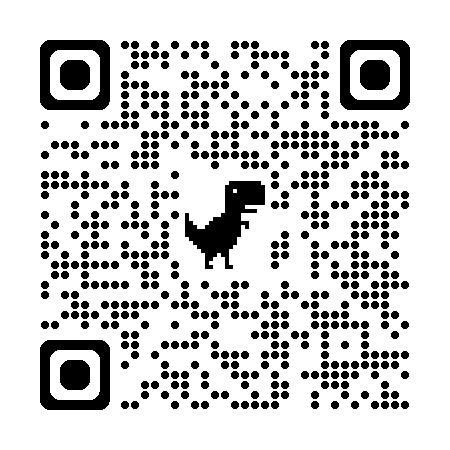

# Arduino RC functions controller
@mainpage

This is an RC functions controller with a wide array of features.
It is very flexible and can control a lot of special functions for
RC models like sound and lights and more.
It is tailored for the ESP32 controller, as it makes usage of many of
the features of that device.

It's inspired by [Rc_Engine_Sound_ESP32](https://github.com/TheDIYGuy999/Rc_Engine_Sound_ESP32)
but the code is completely new.

Web frontend:

[web frontend](./web/index.html)

## License

LGPL

## Features

The controller (project) acts as a configurable central controller unit for RC model
extra functions.

### Inputs

- PWM
- PPM
- BLE (Bluetooth low energy)
- SRXL
- various others: digital pin, a/d, demo

### Outputs

- PWM dimmed ports
- PWM servo output
- ESC controller output (power stage necessary)
- Two channel 22050kHz 8 bit audio output
- BLE (Bluetooth low energy)

### Other

- comprehensive engine simulation
- gear simulation
- vehicle simulation
- freely connect inputs to outputs directly or via functions
- different utility functions (math, fade, delay, ...)
- configurable via Bluetooth [web frontend](./web/index.html)

## Architecture

\ref page_architecture

## Hardware

For HW schematics and layout look at:
[Rc_Engine_Sound_ESP32](https://github.com/TheDIYGuy999/Rc_Engine_Sound_ESP32)

## Getting started

#### Required

The project uses the following tools:

- cmake
- Arduino IDE (https://docs.espressif.com/projects/esp-idf/en/stable/esp32/get-started/index.html)
- libboost-program-options-dev (optional for the engine emulation)
- compiler toolchain (optional for tests)
- python 3 (optional for generating scripts)

#### esp-ide build

The esp-ide build can be done in the usual way:

source ../esp-idf/export.sh
idf.py build

The esp-ide also supports the following commands (usefull)

- flash
- monitor
- menuconfig
- size
- size-components

Finally, the esp tool allows reading out the flash:

esptool.py read_flash  0x001b9000 0x1000 samples_flash.bin

#### CMake build

The project will also build with "vanilla" cmake.
This has the benefit that you can also build the documentation target
and the unit tests.

You will need

- cmake
- make or ninja

For creating documentation you will need:

- doxygen
- plantuml

To build documentation:

    cmake --preset default
    cmake --build --preset default --target doxygen

To build the unit tests:

    cmake --preset default
    cmake --build --preset default

To build the web front-end:

    cmake --preset default
    cmake --build --preset default --target web

To to a target build (including flashing and starting the monitor):

    source ../esp-idf/export.sh
    cmake --preset esp32
    cmake --build --preset esp32 -j4 --target flash --target monitor

To terminate the monitor type Strg-]

### Bluetooth

The project implements a BLE (Bluetooth Low Energy) server that can be connected
to with e.g. a mobile phone.

In order for Web Bluetooth to work you need to enable it (at least on Chrome) and
the website needs to be secure, so it needs to be local or connected via https.

See: [chrome bt internals](about://bluetooth-internals)

## Preparing sounds

All sounds used are 8 bit unsigned PCM 22050 kHz Wav files.
The ones created by Audacity are working, but not all WAV file features are implemented,
so there might be issues with some WAV files.

If the sounds are uploaded via bluetooth (custom sounds) then anything goes, since
the browser will convert the files correctly.

